# etl-airflow-project
# ETL Pipeline with Apache Airflow and BashOperator

This project demonstrates how to build an ETL (Extract, Transform, Load) data pipeline using **Apache Airflow** and the **BashOperator**. It was completed as part of the [IBM ETL and Data Pipelines with Shell, Airflow and Kafka](https://www.coursera.org/learn/etl-data-pipelines-shell-airflow-kafka) course on Coursera.

## 📁 Project Structure

The DAG executes a multi-step ETL process on toll data using shell commands. Tasks include unzipping, extracting data from different formats, consolidating, and transforming it.

### 🔄 DAG Workflow

1. **unzip_data** – Extract compressed `.tgz` data file
2. **extract_data_from_csv** – Extract specific fields from a `.csv` file
3. **extract_data_from_tsv** – Extract fields from a `.tsv` file
4. **extract_data_from_fixed_width** – Extract fields from a fixed-width text file
5. **consolidate_data** – Combine the data from all sources into one `.csv`
6. **transform_data** – Transform the `vehicle_type` column to uppercase

## 🛠️ Technologies Used

- Apache Airflow
- BashOperator
- Bash shell commands (`cut`, `tr`, `paste`, `tar`)
- Python 3.x
- Linux-based environment

## 📸 Screenshots

> Note: These screenshots were taken during development and submitted to Coursera for peer review.

# ETL Airflow Project

This project demonstrates building an ETL data pipeline using Apache Airflow with BashOperator. The pipeline extracts, transforms, and loads toll data from various file formats.

## Project Structure

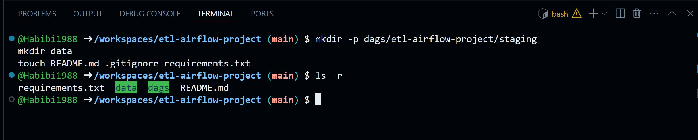

## DAG Definition and Arguments

- DAG arguments screenshot:  
  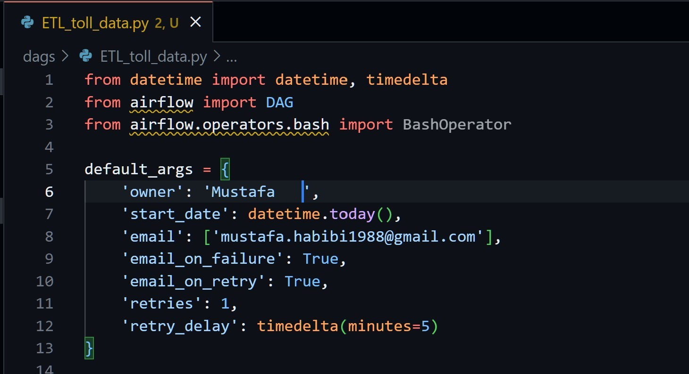  

- DAG definition screenshot:  
  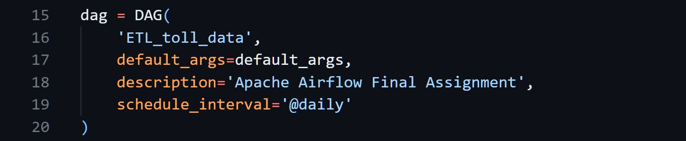

## Tasks Overview

1. Unzip Data  
   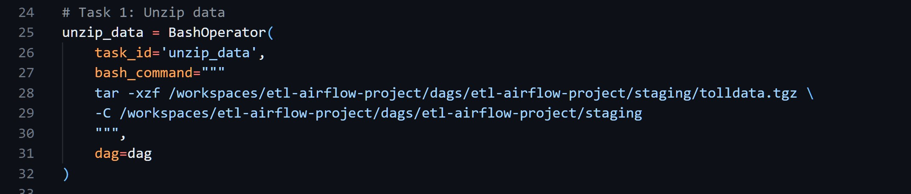

2. Extract Data from CSV  
   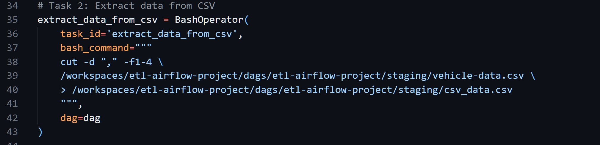

3. Extract Data from TSV  
   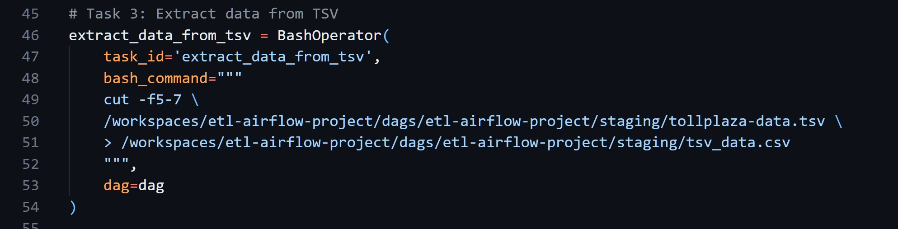

4. Extract Data from Fixed Width File  
   

5. Consolidate Data  
   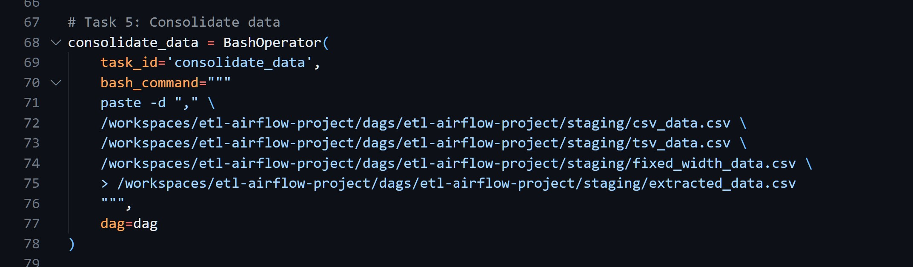

6. Transform Data  
   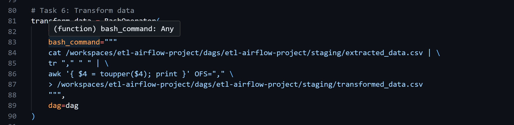

7. Task Pipeline  
   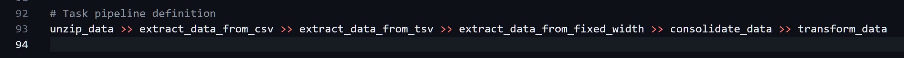

## DAG Submission and Execution

- DAG submitted and listed:  
  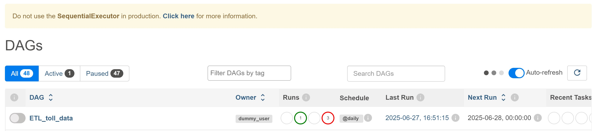

- DAG unpaused and triggered:  
  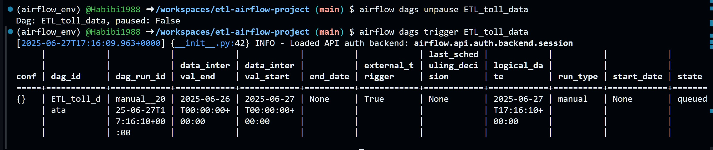

- List of DAG tasks:  
  

- Monitor DAG runs:  
  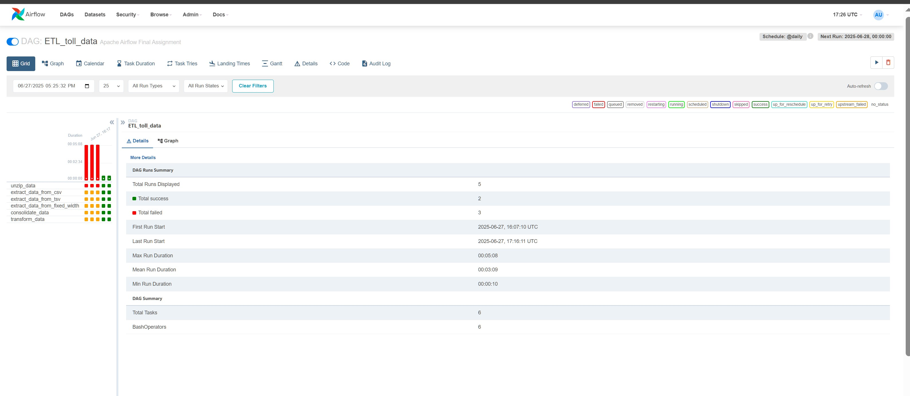

## How to Run

1. Clone the repo
2. Install dependencies
3. Initialize Airflow and place the DAG in the dags folder
4. Unpause and trigger the DAG via CLI or Airflow Web UI
5. Monitor task execution through the Airflow UI or CLI


## ▶️ How to Run Locally

1. Clone the repository:
   ```bash
   git clone https://github.com/yourusername/etl-airflow-project.git
   cd etl-airflow-project
