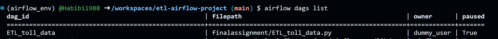
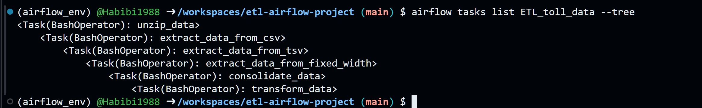

# etl-airflow-project
# ETL Pipeline with Apache Airflow and BashOperator

This project demonstrates how to build an ETL (Extract, Transform, Load) data pipeline using **Apache Airflow** and the **BashOperator**. It was completed as part of the [IBM ETL and Data Pipelines with Shell, Airflow and Kafka](https://www.coursera.org/learn/etl-data-pipelines-shell-airflow-kafka) course on Coursera.

## 📁 Project Structure

The DAG executes a multi-step ETL process on toll data using shell commands. Tasks include unzipping, extracting data from different formats, consolidating, and transforming it.

### 🔄 DAG Workflow

1. **unzip_data** – Extract compressed `.tgz` data file
2. **extract_data_from_csv** – Extract specific fields from a `.csv` file
3. **extract_data_from_tsv** – Extract fields from a `.tsv` file
4. **extract_data_from_fixed_width** – Extract fields from a fixed-width text file
5. **consolidate_data** – Combine the data from all sources into one `.csv`
6. **transform_data** – Transform the `vehicle_type` column to uppercase

## 🛠️ Technologies Used

- Apache Airflow
- BashOperator
- Bash shell commands (`cut`, `tr`, `paste`, `tar`)
- Python 3.x
- Linux-based environment

## 📸 Screenshots

> Note: These screenshots were taken during development and submitted to Coursera for peer review.

## Screenshots

### DAG Arguments


### DAG Definition


### Unzip Data Task


### Extract CSV Task


### Extract TSV Task


### Extract Fixed Width Task


### Consolidate Data Task


### Transform Data Task


### Task Pipeline


### DAG Submission


### Unpause & Trigger DAG


### DAG Tasks List


### DAG Runs


## ▶️ How to Run Locally

1. Clone the repository:
   ```bash
   git clone https://github.com/yourusername/etl-airflow-project.git
   cd etl-airflow-project
