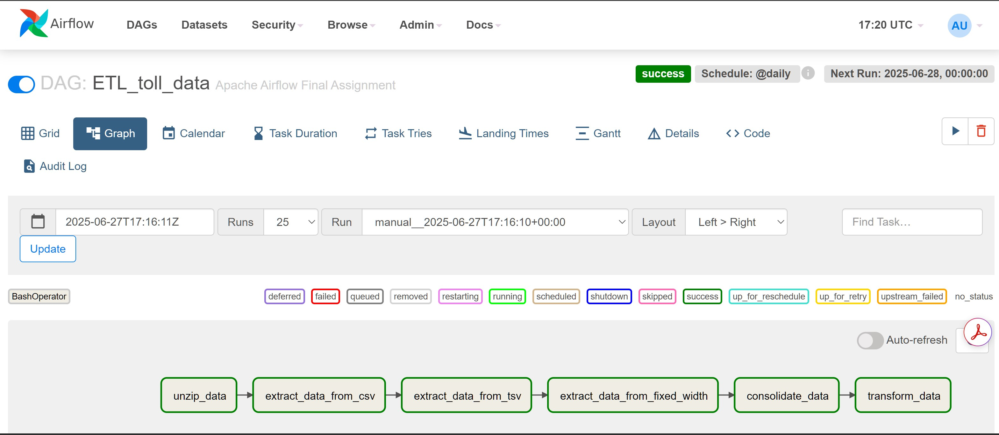

# etl-airflow-project
# ETL Pipeline with Apache Airflow and BashOperator

This project demonstrates how to build an ETL (Extract, Transform, Load) data pipeline using **Apache Airflow** and the **BashOperator**. It was completed as part of the [IBM ETL and Data Pipelines with Shell, Airflow and Kafka](https://www.coursera.org/learn/etl-data-pipelines-shell-airflow-kafka) course on Coursera.

## 📁 Project Structure

The DAG executes a multi-step ETL process on toll data using shell commands. Tasks include unzipping, extracting data from different formats, consolidating, and transforming it.

### 🔄 DAG Workflow

1. **unzip_data** – Extract compressed `.tgz` data file
2. **extract_data_from_csv** – Extract specific fields from a `.csv` file
3. **extract_data_from_tsv** – Extract fields from a `.tsv` file
4. **extract_data_from_fixed_width** – Extract fields from a fixed-width text file
5. **consolidate_data** – Combine the data from all sources into one `.csv`
6. **transform_data** – Transform the `vehicle_type` column to uppercase

## 🛠️ Technologies Used

- Apache Airflow
- BashOperator
- Bash shell commands (`cut`, `tr`, `paste`, `tar`)
- Python 3.x
- Linux-based environment

## 📸 Screenshots

> Note: These screenshots were taken during development and submitted to Coursera for peer review.

| Task | Screenshot |
|------|------------|
| DAG Arguments |  |
| DAG Definition |  |
| Unzip Task |  |
| Extract CSV |  |
| Extract TSV |  |
| Extract Fixed Width |  |
| Consolidate Data |  |
| Transform Data |  |
| Task Pipeline |  |
| DAG Submission |  |
| DAG Triggered |  |
| DAG Tasks Listed |  |
| DAG Runs |  |

## ▶️ How to Run Locally

1. Clone the repository:
   ```bash
   git clone https://github.com/yourusername/etl-airflow-project.git
   cd etl-airflow-project
